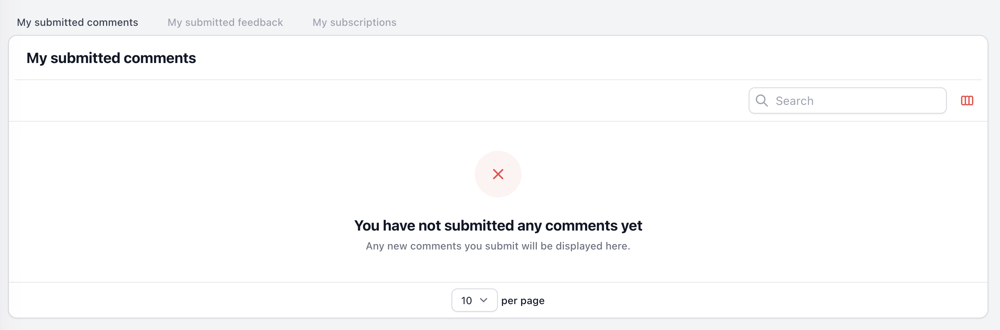

# Multi Widget

<a href="https://github.com/kenepa/resource-lock">

</a>

[](https://packagist.org/packages/kenepa/multi-widget)
[](https://packagist.org/packages/kenepa/multi-widget)

Filament Multi Widget adds a new type of widget to your Filament application. The Multi Widget allows you to combine multiple widgets into a single widget, that can be switched using tabs. This plugin helps clean up your Filament dashboard.

## Installation

You can install the package via composer:

```bash
composer require kenepa/multi-widget
```

## Usage

Create a new Multi Widget by extending the `Kenepa\MultiWidget\MultiWidget` class.

```php
// app/Filament/Widgets/UserMultiWidget.php

class UserMultiWidget extends MultiWidget
{
    public array $widgets = [
        MySubmittedComments::class,
        MySubmittedFeedback::class,
        MySubscriptions::class,
    ];
}
```

The `$widgets` property contains the classes of all the widgets that should be added to your Multi Widget. These are normal [Filament widgets](https://filamentphp.com/docs/2.x/admin/resources/widgets) that you created.  
The Multi Widget above will now render as follows:  



It is advised to make the `canView` method return false on the widgets, so that they are not rendered twice.

## License

The MIT License (MIT). Please see [License File](LICENSE.md) for more information.